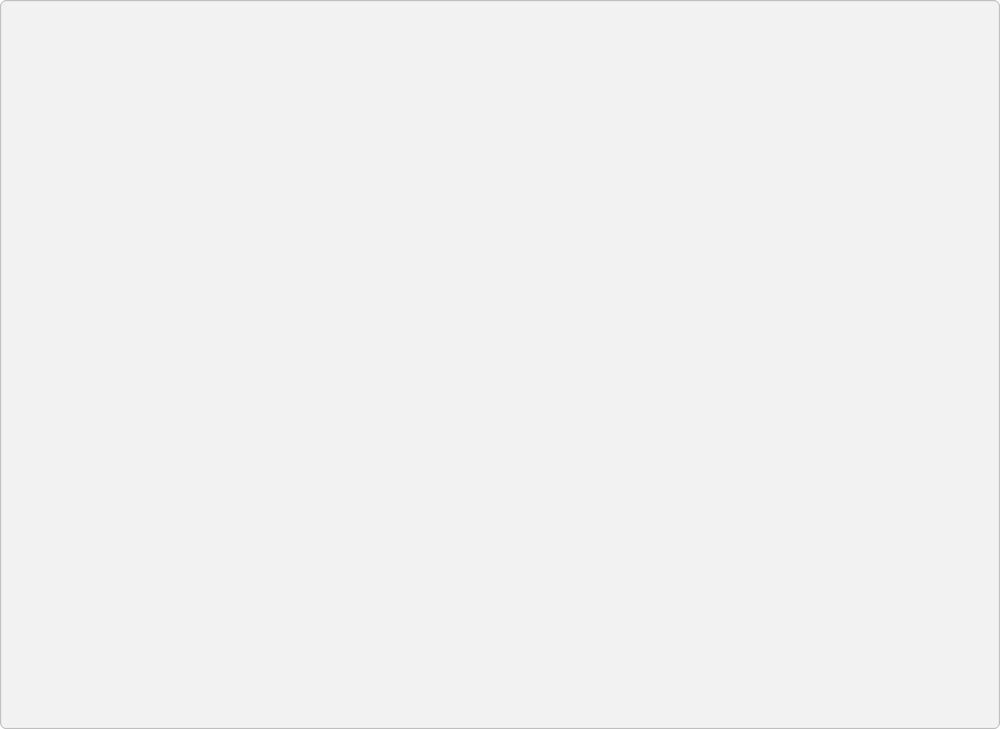
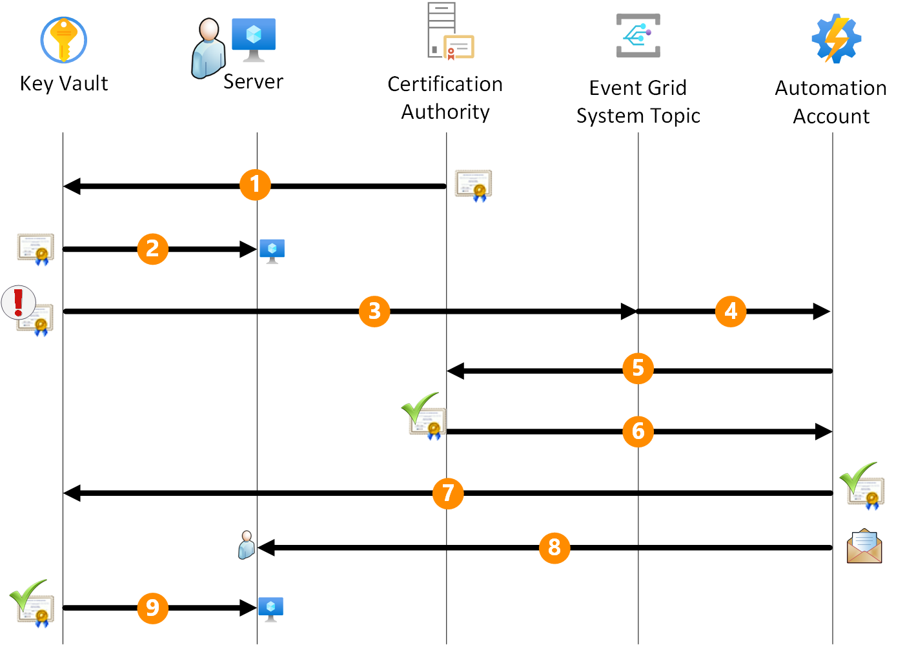

In the realm of cybersecurity, the automatic renewal of certificates is a critical aspect of maintaining a secure and reliable environment. While Azure Key Vault already offers mechanisms for the [automatic renewal of certificates](https://learn.microsoft.com/en-us/azure/key-vault/certificates/overview-renew-certificate?tabs=azure-portal) issued by an integrated Certification Authority (CA), this article focuses on outlining a streamlined process for the automatic renewal of certificates issued by a non-integrated CA.

Azure's Key Vault boasts a robust system for managing cryptographic keys and secrets securely. It integrates seamlessly with integrated CAs, facilitating the automatic renewal of certificates. However, when dealing with non-integrated CAs, a manual approach is often required. This article aims to bridge this gap by elucidating an automated renewal process for certificates from non-integrated CAs, offering efficiency and enhanced security.

## Architecture

Before delving into details of the automated renewal process, let's take a brief look at the architecture that forms the backbone of this solution. 

*Download a [Visio file](./.media/certlc.vsdx) of this architecture.*

The Azure environment in question comprises the following Platform as a Service (PaaS) resources: a **Key Vault**, an **Event Grid System topic**, and an **Automation Account** exposing a webhook targeted by the Event Grid. It is assumed that an existing Public Key Infrastructure (PKI) infrastructure, consisting of a Microsoft Enterprise Certification Authority joined to an Active Directory domain, is already in place for this scenario.

> [!NOTE]
> ***aggiungere da qualche parte che una volta scaricato il certificato sul client, deve essere rifatto il binding con il servizio che lo usa ad esempio IIS***

## Workflow

The automated workflow for certificate renewal within the Azure ecosystem is a well-coordinated process, ensuring the timely and secure update of certificates across servers, whether on Azure (IaaS) or on-premises servers integrated through Azure ARC.

1. **Key Vault Configuration:**
The process begins with the certificates residing within the Key Vault. The certificate should be tagged with the administrator e-mail address for notification purposes. If multiple recipients are required, the e-mail addresses should be separated by comma or semicolon. The expected tag name is 'Recipient' and the value is the e-mail address(es) of the administrator(s).

1. **Key Vault Extension Configuration:**
The servers that need to utilize these certificates are equipped with the Key Vault extension, a versatile tool compatible with *Windows* and *Linux* both Azure-based (IaaS) servers and on-premises servers integrated through *Azure ARC*. The Key Vault extension is configured to periodically poll the Key Vault for any updated certificates. This polling interval is customizable, allowing flexibility to align with specific operational requirements.

1. **Event Grid and Automation Account Integration:**
When the certificate is near to expire, the Event Grid intercepts this event. Upon detection, the Event Grid triggers the execution of a RunBook through the webhook configured in the Automation Account.

1. **Hybrid RunBook Worker Execution:**
    - The RunBook, executed within the Certification Authority configured as a Hybrid RunBook Worker, takes as input the webhook body containing the name of the expiring certificate and the Key Vault hosting it. 
    - Leveraging Azure connectivity, the script within the RunBook connects to Azure to retrieve the certificate's template name used during its generation.
    - Subsequently, the script interfaces with the Key Vault, initiating a certificate renewal request. This request results in the generation of a Certificate Signing Request (CSR).

1. **RunBook start certification authority renewal process:**
The script downloads the CSR and submits it to the Certification Authority.

1. **Certificate renewal:**
 The Certification Authority generate a new certificate based on the correct template and send it back to the script. This ensures that the renewed certificate aligns with the predefined security policies.

1. **Certificate Import and Key Vault Update:**
The script imports the renewed certificate back into the Key Vault, finalizing the update process. 

1. **E-mail notification:**
A the same time, the script sends an e-mail notification to the administrator, informing them of the successful renewal of the certificate.

1. **Certificate retrieval:**
The Key Vault extension running on the server plays a pivotal role in this phase by automatically downloading the latest version of the certificate from the Key Vault into the local store of the server utilizing it.

## Components
The solution uses several components to allow smooth certificate renewal: in the following chapters, each component and its purpose are explained in details.

> [!NOTE]
> + Inserire i macro passi come se dovessi implemenare la soluzione manualmente
> + inserire qui anche gli aspetti di sicurezza e gli eventuali improvement con la Logic App oppure riferimento ad articolo per le chiamate autenticate con beerer verso il webhook 

### Key Vault Extension
The Key Vault Extension is a crucial component for automating certificate renewal. It must be installed on servers where certificate renewal automation is desired. The installation procedures for Windows servers can be found at [Key Vault Extension for Windows](https://learn.microsoft.com/en-us/azure/virtual-machines/extensions/key-vault-windows), for Linux servers at [Key Vault Extension for Linux](https://learn.microsoft.com/en-us/azure/virtual-machines/extensions/key-vault-linux), and for Azure ARC-enabled servers at [Azure Key Vault Extension for ARC-enabled Servers](https://techcommunity.microsoft.com/t5/azure-arc-blog/in-preview-azure-key-vault-extension-for-arc-enabled-servers/ba-p/1888739).

> [!NOTE]
> + inserire qualche esempio di quelli che abbiamo provato ?
### Automation Account
The Automation Account acts as the orchestrator for the certificate renewal process. It needs to be configured with a RunBook, and the PowerShell script for the RunBook can be found [here](./.RunBook/RunBook_v2.ps1). Additionally, an Hybrid Worker Group must be created, associating it with the Certification Authority for executing RunBooks. The RunBook should have a webhook associated with it, initiated from the Hybrid RunBook Worker.

> [!NOTE!]
> inserire link su come si crea hybrid worker, RunBook e webhook ???

### Hybrid RunBook worker
The Hybrid RunBook Worker plays a pivotal role in executing RunBooks. It needs to be installed with the Key Vault Extension, which is the supported mode for the new installation. The Hybrid RunBook Worker should contain the Certification Authority, which can be either on Azure or on-premises.

### Azure Key Vault
Azure Key Vault is the secure repository for certificates. The Automation Account and the server requiring certificate access must be granted specific permissions within the Key Vault. The permission model should include 'Get' and 'List' permissions for the automation account and the server. Additionally, in the Event section of the Key Vault, the Event Grid System Topic should be associated with the webhook of the Automation Account.

> [!NOTE]
>+ inserire i RUOLI corretti che devono essere assegnati all'automation account e al server che deve leggere il certificato
>+ inserire che nella sezione Event deve essere associato l'eventgrid system topic con il webhook dell'automation account

### Azure Event Grid
Event Grid facilitates event-driven communication within the Azure environment. It needs to be configured with the Event Grid System Topic and the Event Subscription. This ensures that relevant events, such as certificate expiration alerts, trigger the necessary actions within the automation workflow.

## Deploy this scenario
bla bla bla

>[NOTE!]
> questo pulsante effettua il deployment dell'ambiente DEMO comprensivo di DC e CA. Eventualmente mettere un riferimento al deployment dell'ambiente demo e qui fare un estratto del json solo per la parte paas descritta in questo articolo.

## Contributors

*This article is maintained by Microsoft. It was originally written by the following contributors.*

Principal author:

- [Fabio Masciotra](https://www.linkedin.com/in/fabiomasciotra/) | Principal Consultant
- [Angelo Mazzucchi](https://www.linkedin.com/in/angelo-mazzucchi-a5a94270) | Delivery Architect

*To see non-public LinkedIn profiles, sign in to LinkedIn.*

## Next steps
bla bla bla

## Related resources
bla bla bla
